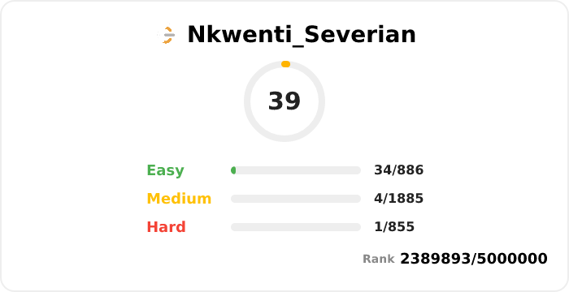

## 🌟 Profile Views  

 

 

  

 

 

### 🧑‍💻 About Me

- 💻 I’m an **associate full-stack software engineer** , fueled by a strong passion for fullstack web development and cutting-edge technologies.  
- 🐧 **Linux** is my daily operating system—I enjoy customizing and optimizing my development environment for efficiency and performance.  
- 🎨 I have a growing interest in **backend development**.  
- 🦀 I'm actively learning and building real-world projects in **Rust**, including web backends with **SpringBoot**, GitHub Actions automation, and system-level tools.  
- ☕ I also work with **Axum** to develop robust backend systems, integrate databases, and implement scalable APIs.  
- 🚀 I’m committed to mastering software architecture, modern DevOps practices, and contributing to open source projects as part of my learning journey.

 

## :chart_with_upwards_trend:	 Stats 👨‍💻 LeetCode

 

## ⚡ Technologies

 

  
  

###

 

  
  
  

###

 

  
  

###

## 🤝 Join an Active Open Source Community!

Are you passionate about coding, learning, and collaborating with other developers? Do you want to contribute to real-world projects, grow your skills, and be part of a vibrant, supportive community?

**Join [Stack-Forge-dev](https://github.com/Stack-Forge-dev)!**

Stack-Forge-dev is a Cameroonian-led open source organization where junior and senior developers work together, mentor each other, and build impactful solutions. Whether you're a beginner or an experienced developer, you'll find opportunities to learn, teach, and make a difference.

👉 [Click here to join or learn more!](https://github.com/Stack-Forge-dev)

Let's build, grow, and forge the future of tech—together!

